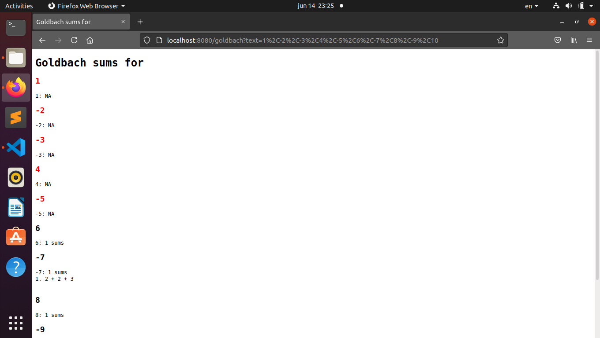
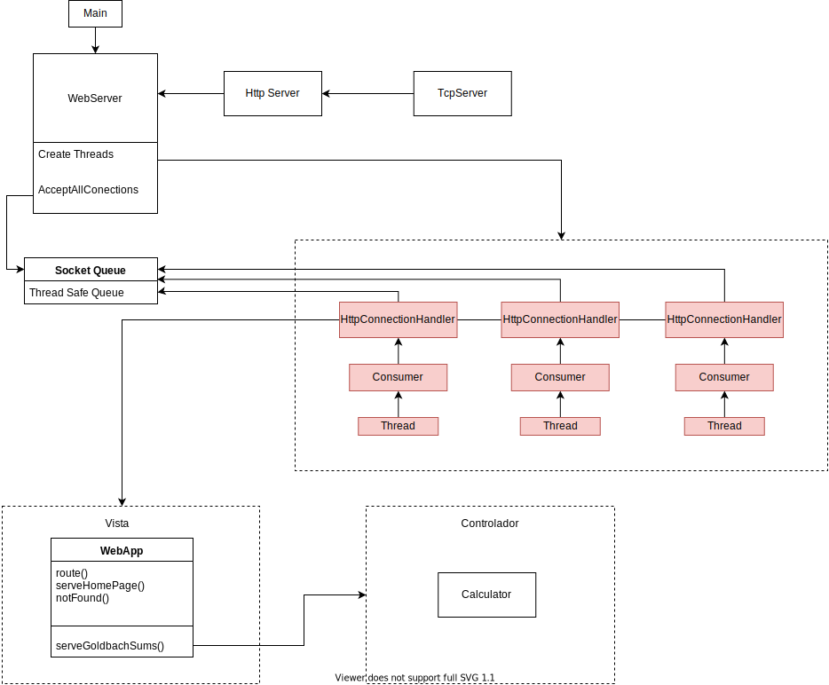

# Proyecto 01-Avance01: Servidor concurrente - Grupo Papatus

## Integrantes:
#### Mauricio Delgado
#### Aaron Campos
#### Axel Matus 

## Sumas de Goldbach
En este proyecto, se implementa un servidor concurrente que permite conocer las sumas de Goldbach que tiene cierto número o una lista de números. 

### Manual de Usuario
Clonar este repositorio en una máquina (Preferiblemente Linux), posteriormente se requiere ingresar al directorio:
```bash
/concurrente21-aaron-axel-mauricio/webserver
``` 
Dentro de directorio debemos ingresar el comando **make** desde la consola para compilar todo el proyecto, tardará unos segundos.
Una vez compilado el proyecto, el ejecutable del servidor web concurrente queda almacenado en la carpeta /bin
Por lo que podemos ejecutarlo de esta manera
```bash
./bin/concurrente21-aaron-axel-mauricio
``` 
Por default el servidor concurrente utilizará el **puerto 8080** y el máximo de conexiones será la cantidad de núcleos que tiene la máquina.
En caso de que el puerto esté ocupado o se quiera abrir en otro puerto y se desee cambiar la cantidad máxima de conexiones se pueden ingresar por argumentos de esta manera:
```bash
./bin/concurrente21-aaron-axel-mauricio [puerto] [conexiones max]
Ejemplo:
./bin/concurrente21-aaron-axel-mauricio 1313 5
``` 
Una vez abierto el servidor podemos ir desde un navegador a este puerto, establecerá una conexión segura con el servidor y se le pueden realizar solicitudes.

Podria verse de esta manera:


Al ingresar ciertos números, la página se refrescará y tendría un aspecto similar a este:



De forma similar se podria cambiar en la URL los numeros e ingresar los deseados, la única restricción es que los números ingresados deben estar **separados por coma (,)**
y no podrán ser números mayores a 9223372036854775807, ni menores a -9,223,372,036,854,775,808.

# Diagrama Diseño

Con el fin de entender el programa y su estructura de manera rápida y sencilla, se puede analizar el siguiente diagrama




