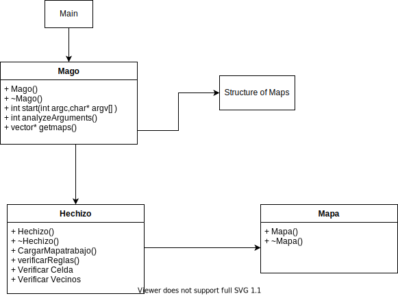
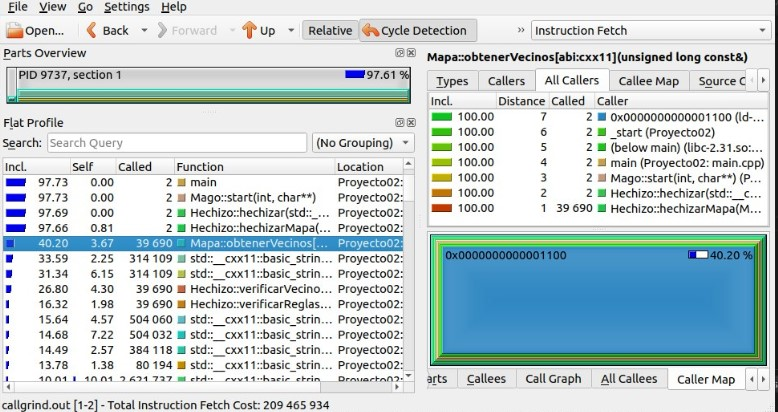
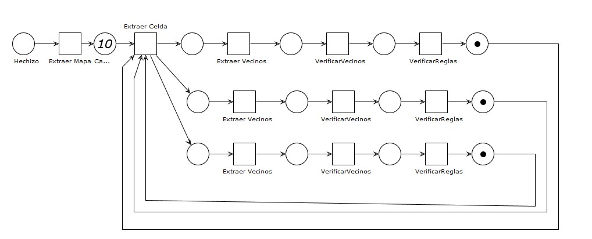
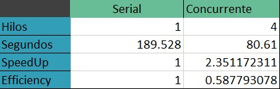
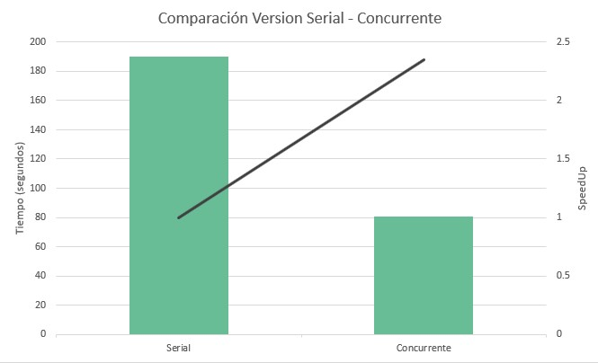

# Proyecto02-Avance01: El bosque encantado  - Grupo Papatus

## Integrantes:
#### Mauricio Delgado
#### Aaron Campos
#### Axel Matus

## Bosque Encantado

Diseño Preeliminar para programa serial

#### Tiempo Ejecución Programa Serial
Usando la orden de trabajo `job002.txt` modificada de la siguiente manera:
~~~
map101.txt -50
map103.txt -40
map105.txt -25`
~~~
El programa serial tuvo un rendimiento de 3 minutos 9 segundos aproximadamente.

#### Profiling
Mediante uso de la herramienta Callgrind de valgrind, se identifican las regiones de código impactan el consumo de CPU.
Se identifica que, además de las impresiones, los métodos de `obtenerVecinos`, `verificarVecinos` y `verificarReglas`son llamados múltiples veces debido a un ciclo que trabaja en todas las casillas del mapa.

Observando el comportamiento del código, se analizó el implementar que cada hilo se encargue de extraer y trabajar cada mapa separado, pero se optó por granular más la solución y que todos los hilos trabajen en un mapa a la vez.
#### Diseño Concurrente

El diseño propuesto es el siguiente:

#### Rendimiento respecto a la versión serial

Luego de la implementación haciendo uso de OMP, se corrió nuevamente el caso de prueba previamente mencionado. El test concurrente se realizó en una máquina local de 4 núcleos (y 4 hilos) y se tomó el promedio de 3 tiempos para realizar el análisis.

Realizando los cambios y con este caso de prueba, se obtuvo un speedup considerable respecto a la versión serial. En casos de pruebas más pequeños tal como `job001.txt`, la versión concurrente puede ser un poco menos eficiente.
